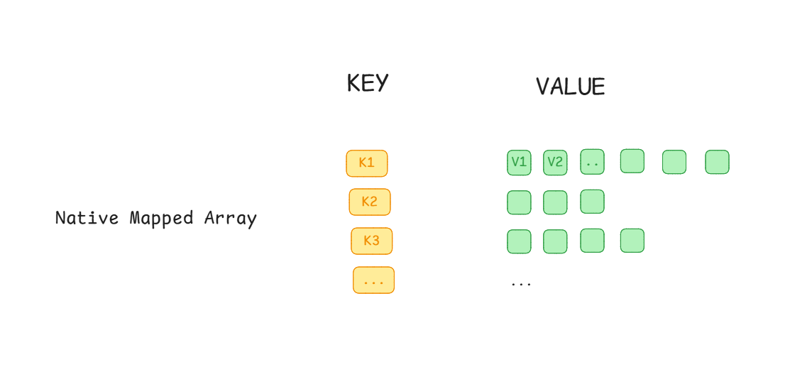
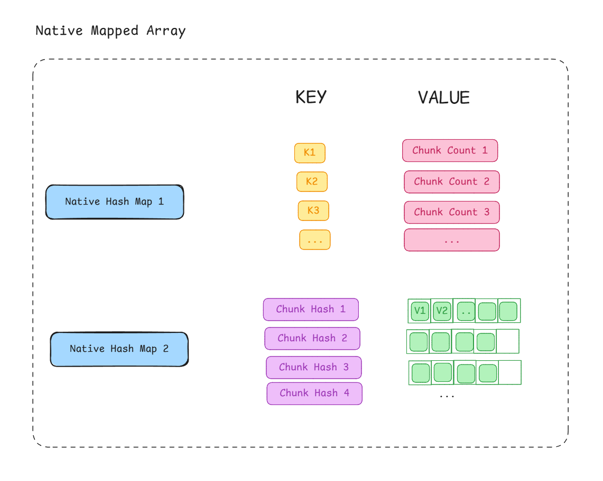
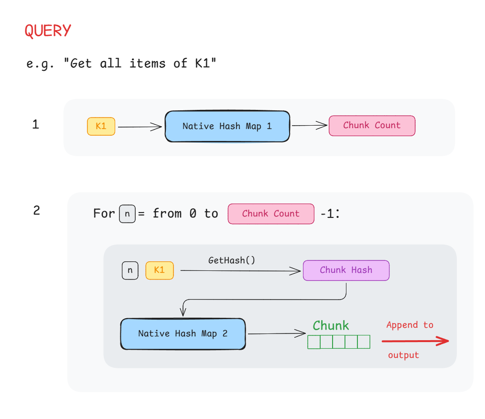
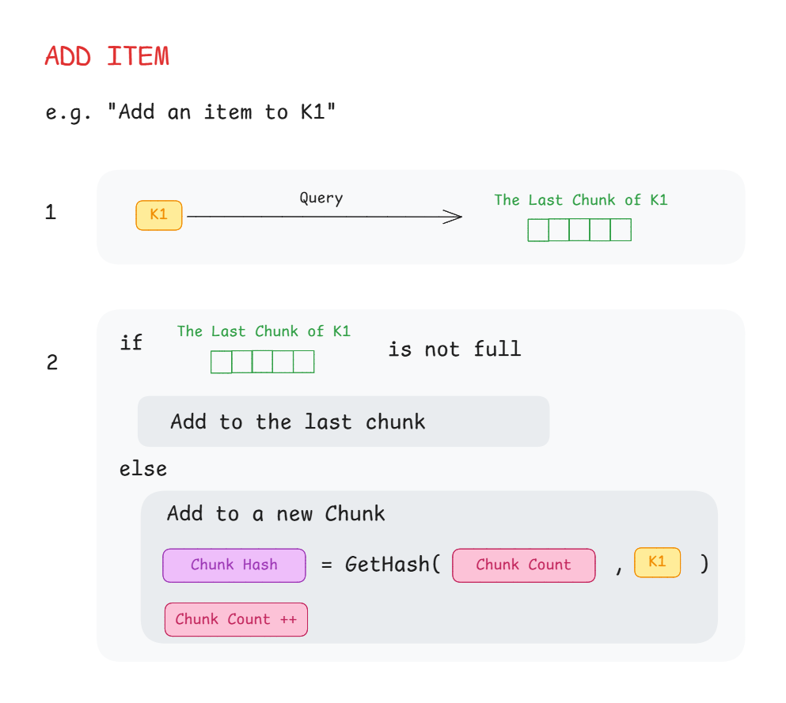
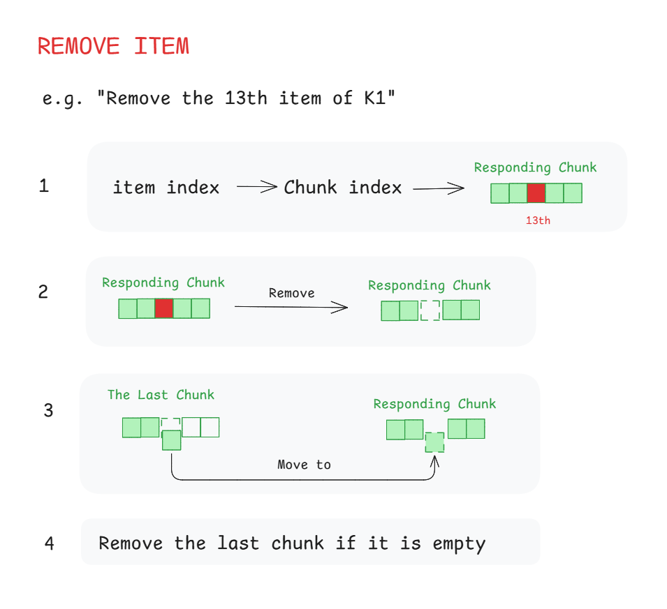

[View on Github](https://github.com/zhanong/Native-Mapped-Array/tree/main)

Essentially, the **Native Mapped Array** is unmanaged struct of a hashmap of arrays.



It has the following features:
- Burst-Compilable.
- Shares capacity space among keys.

# Inside of It



Inside the struct, the values are actually stored in chunks with a fixed size. Each **key** is mapped to multiple chunks through **Chunk Hashes**.
Each chunk belongs to one key. However, the ordering of chunks inside the **Native Hash Map 2** is not defined by keys but by the order of adding.






# Usage

## Constructor
```c#
public NativeMappedArray(int keyCapacity, int arrayCapacity, Allocator allocator)
```
`keyCapacity`  How many keys are expected to contain.
`arrayCapacity`   'Array capacity' for each key.


## Add
```c#
public bool AddKey(TKey key) 
```
If the key doesn't exist, add a key with an empty chunk and return true .

```c#
public bool Add(TKey key, TValue value) 
```
Add value to the last chunk of the key. If a new chunk is added, return true.


## Remove


```c#
public bool RemoveKey(TKey key)
```
Remove a key and all its chunck.


```c#
public bool Remove(TKey key, TValue value)
```
Remove the first item in key's chunks that `Equals(value)`.
(In the worst case, this will traverse all items in chunks that belongs to key.)


```c#
public void RemoveAt(TKey key, int valueIndex)
```
Remove the `valueIndex % chunkSize` item at the `valueIndex / chunkSize` chunk of the key. Use this instead of `Remove()`if possible.


## Access Data
```c#
NativeMappedArray<K, V> map;

/* The best way to get all values */

int valueCount = map.ValueCount(k)
for (int i = 0; i < valueCount; i++)
{
	V value = map.GetValueAt(k, i);
	// Do something.
}
```

# In the Future
The chunk is implemented as List6. It's size is fixed as 6. It's better to make chunk type as a generic type for the structure.

